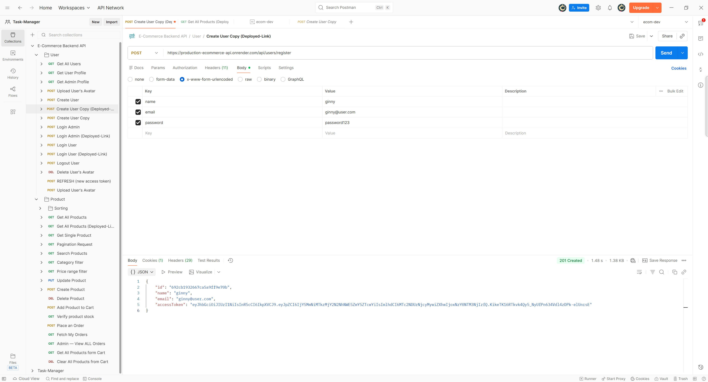
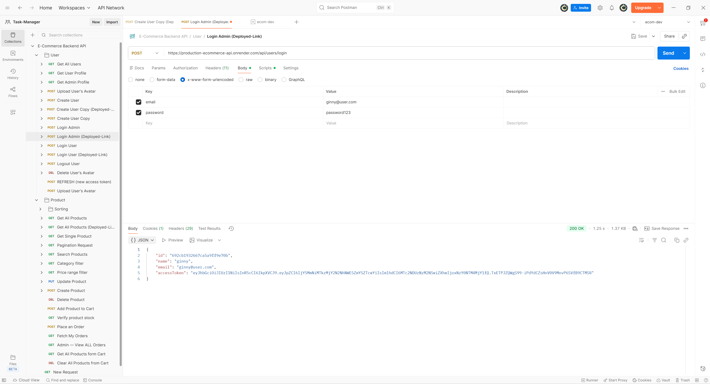
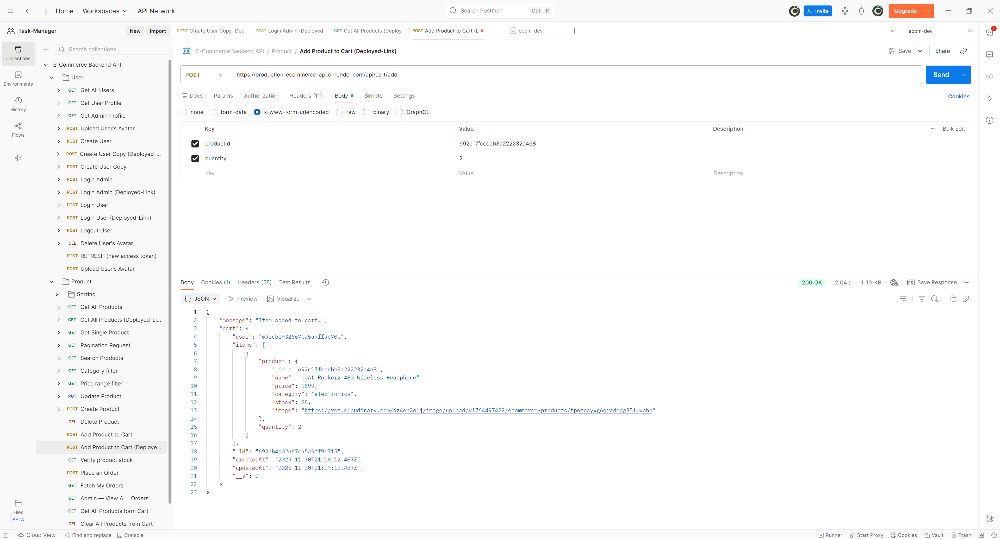
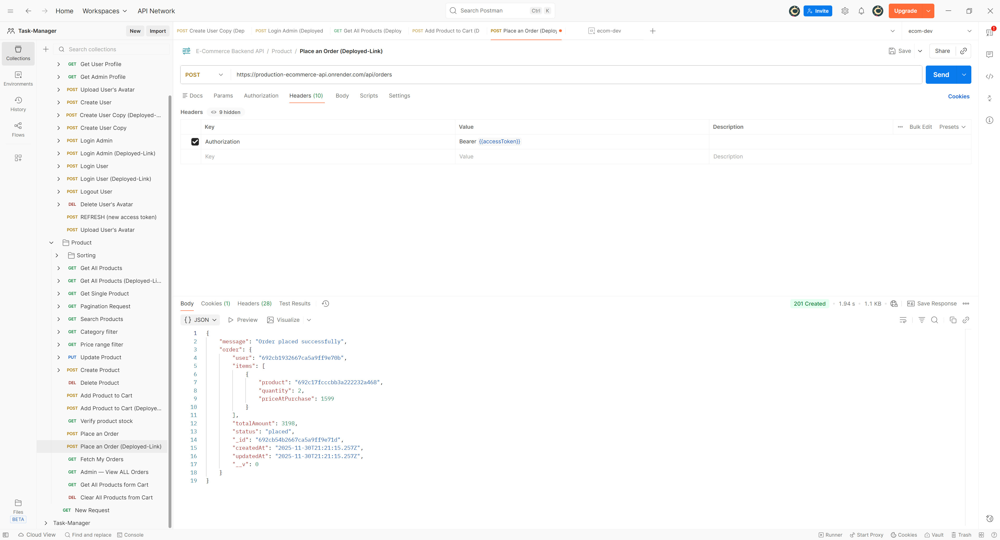
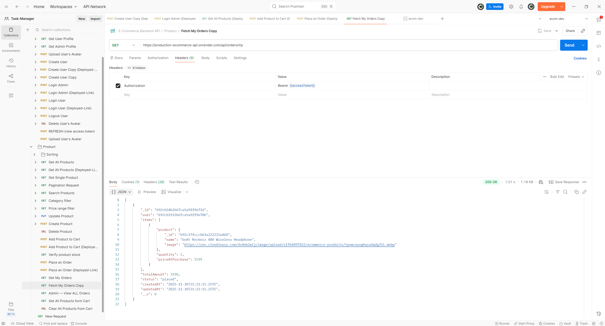

<div align="center">
   
# 🛒 **E-COMMERCE BACKEND API**
### **Fully production-ready backend powering shopping, cart, orders & admin features.**

✨━━━━━━━━━━━━━━━━━━━  **❖**  ━━━━━━━━━━━━━━━━━━━✨
</div>

---

## ⚡ **Quick Features Summary**

✔ JWT Authentication (Access + Refresh Tokens)  
✔ Admin-only Product Management  
✔ Cloudinary Image Uploads (upload_stream)  
✔ Redis Caching (Products + Single Product)  
✔ Advanced Search, Filters, Sort + Pagination  
✔ Full Cart & Order System  
✔ Stock Deduction Logic  
✔ Enterprise Security Middleware  
✔ Clean Modular Architecture  

---

## 🧰 **Tech Stack**


---

## 🌍 **Live Deployment**
🔗 **API URL:** https://production-ecommerce-api.onrender.com  
📁 **GitHub Repo:** https://github.com/Ashishjha013/production-ecommerce-api

---

## 🎯 **Tech Highlights (Why This Backend is Production-Ready)**

- **Cloudinary `upload_stream`** for efficient image handling  
- **Query-aware Redis caching** (search + filters cached separately)  
- **Stock deduction logic inside order processing**  
- **MongoDB aggregation for pricing accuracy**  
- **Strong schema design** for Users, Products, Cart & Orders  
- **Role-based admin protection** on product + order routes  
- **httpOnly cookie storage** for secure refresh token flow  
- **Separate controller/service pattern** for scalability  

---

## 📸 **Screenshots**

### 🔐 Register User


### 👤 Login User


### 🛍 Get Products


### 🛒 Add to Cart


### 📦 Place Order


### 📑 Get My Orders


---

## 🔥 **Full Features (Detailed)**

### 👤 Authentication & Authorization
- Register / Login with hashed passwords  
- Short-lived access tokens  
- Long-lived refresh tokens in **httpOnly cookies**  
- Role-based access → **Admin / User**  
- Logout + token rotation  

---

### 🛍 Product System
- CRUD operations (Admin-only)  
- Image uploads → Cloudinary (via Multer memoryStorage)  
- Advanced search (regex)  
- Sorting by price, date  
- Category + price filtering  
- Pagination  
- Redis caching for:
  - product list  
  - product detail  

---

### 🛒 Cart System
- Add to cart (+ incremental quantity)  
- Remove from cart  
- Clear entire cart  
- User-specific persistent cart  

---

### 📦 Orders System
- Place an order from cart  
- Deduct stock safely  
- Store item snapshot prices  
- User order history  
- Admin can view **all** orders  

---

### 🛡 Security  
- Helmet  
- CORS  
- Express-rate-limit  
- express-mongo-sanitize  
- xss-clean  
- httpOnly cookies  
- Sanitized inputs  

---

## 🧱 **API Modules**

| Module | Endpoints |
|--------|-----------|
| `/api/users` | Register, login, refresh, logout, profile |
| `/api/products` | List, search, sort, create, update, delete |
| `/api/cart` | Add, view, remove, clear |
| `/api/orders` | Place order, get history, admin orders |

---

## 🧪 **Sample API Response (Example)**

```json
{
  "product": {
    "name": "Nike Air Zoom",
    "price": 4999,
    "category": "Shoes",
    "stock": 12,
    "image": "https://cloudinary.com/xyz",
    "createdBy": "674d1fbe9c8f123abc45ef90"
  }
}

```
---

## 🏗 Architecture Overview
```

[Client]
   |
 HTTPS
   |
[Express Server]
   ├── Auth (JWT)
   ├── Products
   ├── Cart
   ├── Orders
   ├── Redis Cache Layer
   ├── MongoDB Atlas
   └── Cloudinary (images)
```

---

## 📦 Setup (Local Development)

### 1️⃣ Clone Repo
```bash
git clone https://github.com/Ashishjha013/production-ecommerce-api
cd production-ecommerce-api
```

### 2️⃣ Install Dependencies
```bash
npm install
```

### 3️⃣ Create `.env` file

```
PORT=8080
MONGO_URI=your_mongo_uri
JWT_SECRET=your_secret
JWT_REFRESH_SECRET=your_refresh_secret

REDIS_URL=your_redis_cloud_url

CLOUDINARY_CLOUD_NAME=...
CLOUDINARY_API_KEY=...
CLOUDINARY_API_SECRET=...

CLIENT_URL=http://localhost:3000
```

### 4️⃣ Run
```bash
npm start
```

---

## 🧪 Test Flow
- Register → Login  
- Check cookies stored  
- Add product to cart  
- Create order  
- Check Redis cache  
- Admin views orders & manages products  

---

## ✨ Author
**Ashish Kumar Jha**  
📍 India • Backend Developer

---

## 📬 Contact
- GitHub: https://github.com/Ashishjha013  
- LinkedIn: https://www.linkedin.com/in/ashishjha13  
- Email: ashishjha1304@gmail.com  

---

*Generated README: E‑Commerce Backend — Designed for real production usage.*


